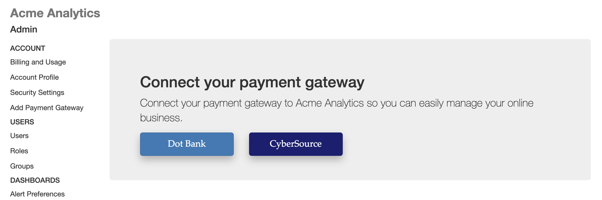
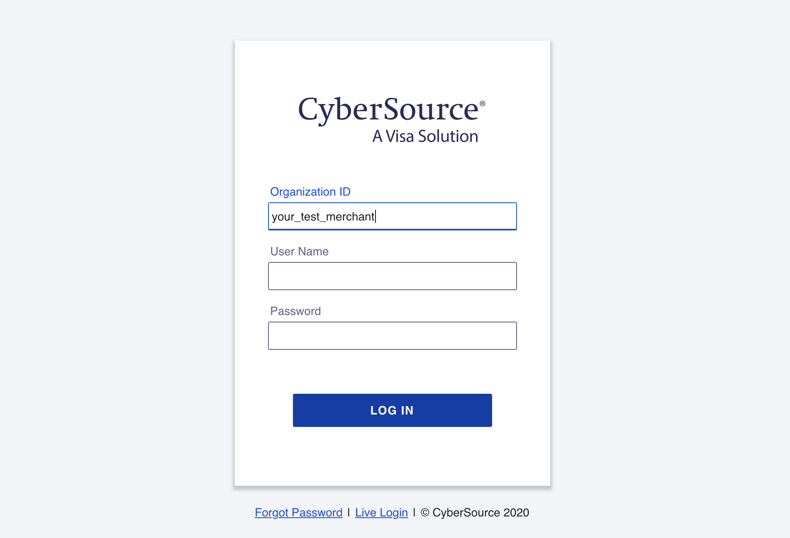
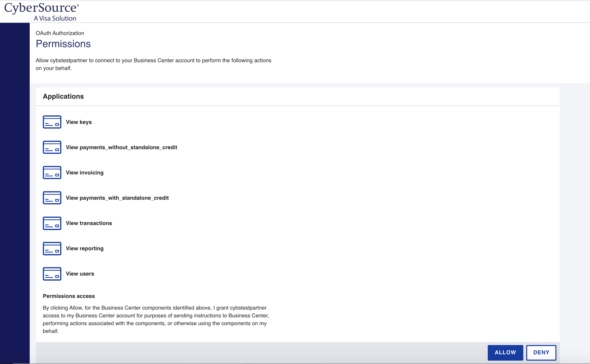
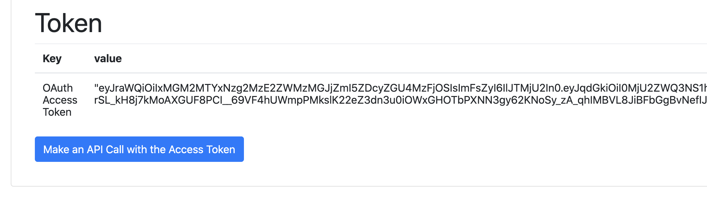
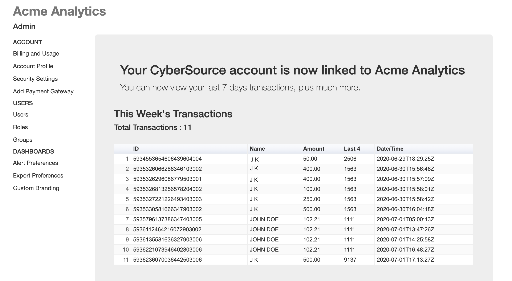

# Sample OAuth Application for CyberSource

This repository provides a simple sample application demonstrating OAuth authentication to CyberSource.

While you can see a running example of this sample code at https://cybsoauthsample.azurewebsites.net/, in order to run this sample yourself you will need to request a new CyberSource test partner application credential.  You can request a test partner account from mailto:developer@cybersource.com With that test account you will be able to log into our partner portal and create your test client application. You will provide a redirect URL so that it can be registered against your test application and you can generate your test client ID & shared secret.
  
__NOTE: If you use our sample client certificates to quickly test your application you will need to request that your partner Common Name is set to www.paymentsdemo.com. See below for more details on Mutual Authentication.__
  
See our full documentation at https://developer.cybersource.com/api/developer-guides/OAuth/cybs_extend_intro.html 

## Usage
* Clone this sample
* Update the sample with your test partner application credential
* Deploy the sample to your test site and register your redirect URL
* Test the flow by confirming the merchant experience below.

## Requirements
* Node
* Express
* NPM

## Who Should Use This Sample
Software partners with a cloud-based SAAS application, such as an e-commerce application, invoicing application, any software which requires payments, can use this sample to connect their customers accounts to their CyberSource account.  Using OAuth you can remove all the manual steps required to guide your users through the generation, retrieval and input of API keys.  All your users need to do is validate their CyberSource account, approve the connection of your software with their CyberSource account and they're ready to go.


## How To Use This Sample
This sample is based on a very simple node application and effectively demonstrates 3 key steps which could easily be implemented from any web-based application:

### Step 1. Redirect the user to validate their CyberSource account, with a "Connect to CyberSource" button.  
In your application link to the CyberSource OAuth URL, including the required URL parameters.  

From our sample this is https://github.com/CyberSource/cybersource-oauth-samples-node/blob/master/views/index.ejs



### Merchant Authentication & Authorization. 

The merchant will authenticate and the authorize your application to connect with their CyberSource account.





### Step 2. Retrieve an access token. 
Call the CyberSource /tokens endpoint with your credentials, plus the authorization code returned from Step 1.  

From our sample this is https://github.com/CyberSource/cybersource-oauth-samples-node/blob/master/app.js /authorize  



### Step 3. Call any of the approved APIs on behalf of your user, with the CyberSource access token.  

From our sample this is https://github.com/CyberSource/cybersource-oauth-samples-node/blob/master/app.js /apicall



__NOTE:  A refresh token, returned in step 2 can be used at any time to revalidate your connection and retrieve a fresh access token__
  
## Mutual Authentication
Mutual authentication can sometimes feel complicated due to the requirement to have a client-side certificate, however we have tried to simplify this as much as possible by providing a sample certificate with this sample application.  To use this sample with your own test partner account you simply have to request that your partner test account is configured with the Common Name attribute www.paymentsdemo.com.
  
When you have your own client certificate you just need to have your partner test account (and ultimately production partner account) configured to then use your own CN (Common Name).  Here are the steps for procuring your own client certificate.  

### Generate Your CSR
For this step you can use OpenSSL (or another tool) to generate your certificate request.  Remember you will need your private key later when you get the certificate issued.
````
openssl req -newkey rsa:2048 -keyout paymentsdemo-csr.key -out paymentsdemo.csr
````
### Request a Certificate
Request a certificate from a CA (Certification Authority), using the CSR file generated in the step above. A client certificate is essentially the same as a server certificate so that is usually what you need to request.  Once the CSR has been submitted you will have the standard process or organization and domain verification, after which you will be issued with a certificate.
### Use the Certificate 
See examples here for node.js (app.js line 69 & 70).  Regardless of your client you will generally associate the certificate and private key with your HTTP Request object similar to this sample.

  
## Becoming a CyberSource Partner
Once you have successfully tried the sample application you can contact CyberSource to become a registered software partner and retrieve your partner credentials.
